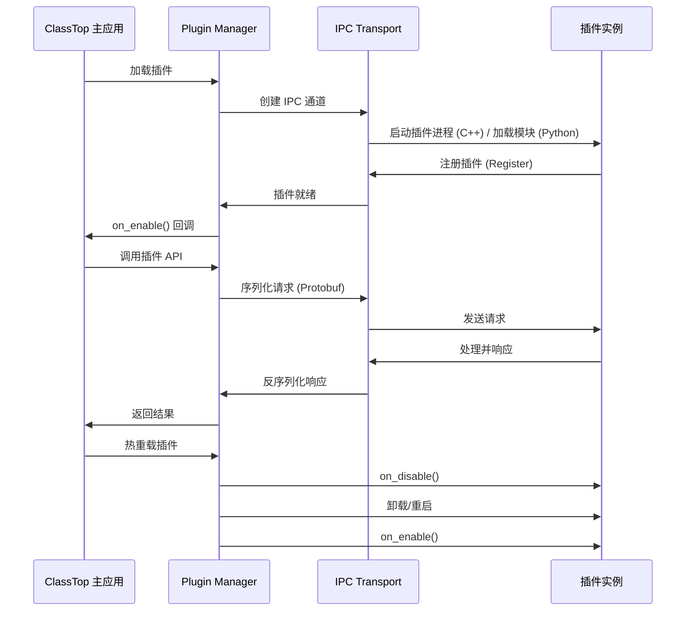

# ClassTop 插件系统 IPC 规范文档

## 目录

1. [概述](#概述)
2. [架构设计](#架构设计)
3. [插件类型](#插件类型)
4. [IPC 通信机制](#ipc-通信机制)
5. [消息协议](#消息协议)
6. [Python 插件 API](#python-插件-api)
7. [C++ 插件 API](#c-插件-api)
8. [生命周期管理](#生命周期管理)
9. [安全与认证](#安全与认证)
10. [错误处理](#错误处理)
11. [性能优化](#性能优化)

---

## 概述

ClassTop 插件系统支持 **Python** 和 **C++** 两种插件类型,通过统一的 IPC (进程间通信) 机制与主应用进行交互。

### 设计目标

- **跨语言支持**: Python 和 C++ 插件使用统一的 IPC 协议
- **高性能**: C++ 插件通过共享内存和零拷贝实现高性能通信
- **安全性**: 基于证书的认证机制,沙箱隔离
- **易用性**: 提供高级 API 封装,开发者无需关心底层细节
- **热重载**: 支持插件热更新,无需重启主应用
- **类型安全**: 使用 Protocol Buffers 定义消息格式

### 技术栈

| 组件 | Python 插件 | C++ 插件 |
|------|------------|----------|
| **IPC 机制** | gRPC / Named Pipes | gRPC / 共享内存 |
| **序列化** | Protocol Buffers | Protocol Buffers |
| **进程模型** | 单进程多线程 | 独立进程 |
| **语言版本** | Python 3.10+ | C++17 |
| **构建系统** | setuptools | CMake / Visual Studio |

---

## 架构设计

### 整体架构

```
┌─────────────────────────────────────────────────────────────┐
│                     ClassTop 主应用                          │
│                                                              │
│  ┌───────────────────────────────────────────────────────┐  │
│  │                  Plugin Manager                        │  │
│  │  - 插件发现和加载                                       │  │
│  │  - 生命周期管理                                         │  │
│  │  - IPC 路由                                            │  │
│  └───────────────────────────────────────────────────────┘  │
│                        ↕ IPC                                │
│  ┌───────────────────────────────────────────────────────┐  │
│  │              IPC Transport Layer                       │  │
│  │                                                         │  │
│  │  ┌──────────────┐  ┌──────────────┐  ┌─────────────┐  │  │
│  │  │ gRPC Server  │  │ Named Pipes  │  │Shared Memory│  │  │
│  │  └──────────────┘  └──────────────┘  └─────────────┘  │  │
│  └───────────────────────────────────────────────────────┘  │
└─────────────────────────────────────────────────────────────┘
                         ↕ IPC
┌─────────────────────────────────────────────────────────────┐
│                        插件实例                              │
│                                                              │
│  ┌────────────────────┐         ┌────────────────────────┐  │
│  │   Python 插件      │         │      C++ 插件          │  │
│  │                    │         │                        │  │
│  │  - plugin.py       │         │  - plugin.so/.dll      │  │
│  │  - plugin.yaml     │         │  - plugin.yaml         │  │
│  │  - plugin_ui.js    │         │  - plugin_ui.js        │  │
│  │  - plugin.crt      │         │  - plugin.crt          │  │
│  └────────────────────┘         └────────────────────────┘  │
└─────────────────────────────────────────────────────────────┘
```

### 通信流程



---

## 插件类型

### 1. Python 插件 (In-Process)

**特点**:
- 与主应用运行在同一进程
- 通过 Python 模块导入机制加载
- 直接访问主应用的 Python API
- 适合快速开发和原型验证

**优势**:
- ✅ 开发简单,无需编译
- ✅ 热重载支持良好
- ✅ 调试方便
- ✅ 与主应用共享内存

**劣势**:
- ⚠️ 性能受 Python GIL 限制
- ⚠️ 沙箱隔离较弱
- ⚠️ 崩溃可能影响主应用

**使用场景**:
- UI 扩展
- 数据处理
- 工作流自动化
- 与第三方服务集成

### 2. C++ 插件 (Out-of-Process)

**特点**:
- 独立进程运行
- 通过 IPC 与主应用通信
- 编译为动态链接库 (.so / .dll)
- 适合高性能计算

**优势**:
- ✅ 高性能,无 GIL 限制
- ✅ 沙箱隔离强
- ✅ 崩溃不影响主应用
- ✅ 支持共享内存零拷贝

**劣势**:
- ⚠️ 需要编译
- ⚠️ 跨平台兼容性需处理
- ⚠️ 调试相对复杂

**使用场景**:
- 图像/视频处理
- 机器学习推理
- 数据库集成
- 实时数据流处理

---

## IPC 通信机制

### 通信方式对比

| IPC 方式 | Python 插件 | C++ 插件 | 延迟 | 吞吐量 | 适用场景 |
|---------|------------|----------|------|--------|----------|
| **gRPC** | ✅ 推荐 | ✅ 推荐 | 1-5ms | 高 | 通用场景 |
| **Named Pipes** | ✅ 支持 | ✅ 支持 | 10-50ms | 中 | Windows 环境 |
| **共享内存** | ❌ | ✅ 推荐 | <1ms | 极高 | 大数据传输 |
| **Direct Call** | ✅ 推荐 | ❌ | 0.1ms | 极高 | Python In-Process |

### 1. gRPC (推荐)

**适用**: Python 和 C++ 插件的主要通信方式

**优势**:
- 跨语言支持
- Protocol Buffers 类型安全
- 双向流通信
- 内置负载均衡和重试

**配置示例**:
```yaml
# plugin.yaml
ipc:
  protocol: grpc
  address: "localhost:50052"  # 插件 gRPC 服务器地址
  timeout: 30
  tls:
    enabled: true
    cert: "./plugin.crt"
    key: "./plugin.key"
```

### 2. 共享内存 (C++ 插件专用)

**适用**: C++ 插件处理大数据 (图像、视频、音频)

**优势**:
- 零拷贝,极低延迟
- 高吞吐量 (>10GB/s)
- 适合实时处理

**实现**:
```cpp
// C++ 插件
#include "classtop/shared_memory.h"

// 创建共享内存区域
auto shm = classtop::SharedMemory::Create("plugin_data", 1024 * 1024);  // 1MB

// 写入数据
auto* buffer = static_cast<uint8_t*>(shm->GetBuffer());
memcpy(buffer, image_data, image_size);

// 通知主应用数据已就绪
plugin_api->NotifySharedMemoryReady("plugin_data", image_size);
```

```python
# Python 主应用
import classtop.shared_memory as shm

# 读取共享内存
data = shm.read("plugin_data", size=1024*1024)
```

### 3. 直接调用 (Python 插件专用)

**适用**: Python 插件 (In-Process)

**实现**:
```python
# Python 插件
class MyPlugin(Plugin):
    async def process_data(self, data: dict) -> dict:
        # 直接被主应用调用,无 IPC 开销
        result = self.analyze(data)
        return {"status": "ok", "result": result}
```

```python
# Python 主应用
plugin = plugin_manager.get_plugin("my-plugin")
result = await plugin.process_data({"value": 100})
```

---

## 消息协议

### Protocol Buffers 定义

**classtop_plugin.proto**:
```protobuf
syntax = "proto3";

package classtop.plugin;

// ========== 插件注册 ==========

message PluginRegisterRequest {
  string plugin_id = 1;          // 插件 ID
  string plugin_name = 2;         // 插件名称
  string version = 3;             // 版本号
  repeated string permissions = 4; // 权限列表
  bytes certificate = 5;          // 开发者证书
}

message PluginRegisterResponse {
  bool success = 1;
  string message = 2;
  string session_token = 3;       // 会话令牌
}

// ========== API 调用 ==========

message PluginApiRequest {
  string api_name = 1;            // API 名称
  bytes payload = 2;              // 参数 (JSON 序列化)
  map<string, string> metadata = 3; // 元数据
}

message PluginApiResponse {
  bool success = 1;
  string error_message = 2;
  bytes result = 3;               // 返回值 (JSON 序列化)
}

// ========== 事件通知 ==========

message PluginEvent {
  string event_name = 1;          // 事件名称
  bytes event_data = 2;           // 事件数据 (JSON)
  int64 timestamp = 3;            // 时间戳
  string source_plugin_id = 4;    // 来源插件 ID
}

message PluginEventAck {
  bool received = 1;
}

// ========== 生命周期 ==========

message PluginLifecycleRequest {
  enum Action {
    ENABLE = 0;
    DISABLE = 1;
    RELOAD = 2;
    SHUTDOWN = 3;
  }
  Action action = 1;
  bytes state_data = 2;           // 状态数据 (用于热重载)
}

message PluginLifecycleResponse {
  bool success = 1;
  string message = 2;
  bytes saved_state = 3;          // 保存的状态 (用于热重载)
}

// ========== gRPC 服务定义 ==========

service ClassTopPluginService {
  // 注册插件
  rpc Register(PluginRegisterRequest) returns (PluginRegisterResponse);

  // 调用主应用 API
  rpc CallApi(PluginApiRequest) returns (PluginApiResponse);

  // 订阅事件流
  rpc SubscribeEvents(stream PluginEventAck) returns (stream PluginEvent);

  // 生命周期管理
  rpc Lifecycle(PluginLifecycleRequest) returns (PluginLifecycleResponse);
}
```

### 消息格式说明

#### 1. 注册消息

**用途**: 插件启动时向主应用注册

**流程**:
```
插件 → PluginRegisterRequest → 主应用
主应用 → PluginRegisterResponse (包含 session_token) → 插件
```

**示例**:
```json
// PluginRegisterRequest (JSON 表示)
{
  "plugin_id": "com.example.myplugin",
  "plugin_name": "My Plugin",
  "version": "1.0.0",
  "permissions": ["read:courses", "emit:events"],
  "certificate": "<base64-encoded-cert>"
}
```

#### 2. API 调用消息

**用途**: 插件调用主应用提供的 API

**流程**:
```
插件 → PluginApiRequest → 主应用
主应用 → PluginApiResponse → 插件
```

**示例**:
```json
// PluginApiRequest
{
  "api_name": "get_courses",
  "payload": "{\"week\": 1}",
  "metadata": {
    "session_token": "abc123",
    "timestamp": "1635724800"
  }
}
```

#### 3. 事件订阅

**用途**: 插件订阅主应用的事件流

**流程**:
```
插件 → 订阅请求 → 主应用
主应用 → 持续推送事件 → 插件
插件 → 确认收到 (PluginEventAck) → 主应用
```

**示例**:
```json
// PluginEvent
{
  "event_name": "schedule_update",
  "event_data": "{\"course_id\": 123, \"action\": \"added\"}",
  "timestamp": 1635724800,
  "source_plugin_id": "system"
}
```

---

## Python 插件 API

### 基础插件类

```python
# src-tauri/python/tauri_app/plugin_system/base.py

from typing import Dict, Any, Optional
from abc import ABC, abstractmethod

class Plugin(ABC):
    """插件基类"""

    def __init__(self, plugin_api: 'PluginAPI'):
        self.plugin_api = plugin_api
        self.config = {}
        self.state = {}

    @property
    def id(self) -> str:
        """插件 ID"""
        return self.__class__.__name__

    @abstractmethod
    async def on_enable(self):
        """插件启用时调用"""
        pass

    @abstractmethod
    async def on_disable(self):
        """插件禁用时调用"""
        pass

    async def on_save(self) -> Dict[str, Any]:
        """保存插件状态 (用于热重载)"""
        return self.state

    async def on_restore(self, state: Dict[str, Any]):
        """恢复插件状态 (用于热重载)"""
        self.state = state
```

### Plugin API

```python
class PluginAPI:
    """提供给插件的 API 接口"""

    def __init__(self, app_handle, event_bus, logger):
        self.app_handle = app_handle
        self.events = event_bus
        self.logger = logger

    # ========== 课程服务 ==========
    async def get_courses(self) -> List[Course]:
        """获取所有课程"""
        ...

    async def add_course(self, name: str, teacher: str, location: str, color: str) -> int:
        """添加课程"""
        ...

    # ========== 日程服务 ==========
    async def get_schedule_for_week(self, week: int) -> Dict[int, List[ScheduleEntry]]:
        """获取指定周的日程"""
        ...

    async def add_schedule_entry(self, course_id: int, day_of_week: int,
                                   start_time: str, end_time: str, weeks: List[int]) -> int:
        """添加日程条目"""
        ...

    # ========== 事件系统 ==========
    async def emit_event(self, event_name: str, data: Dict[str, Any]):
        """发送事件"""
        self.events.emit(event_name, data)

    def on(self, event_name: str, callback):
        """监听事件"""
        self.events.on(event_name, callback)

    def off(self, event_name: str, callback):
        """取消监听"""
        self.events.off(event_name, callback)

    # ========== 存储服务 ==========
    async def get_setting(self, key: str) -> Optional[str]:
        """获取配置"""
        ...

    async def set_setting(self, key: str, value: str):
        """设置配置"""
        ...

    # ========== 插件私有存储 ==========
    async def get_plugin_data(self, key: str) -> Optional[Any]:
        """获取插件私有数据"""
        ...

    async def set_plugin_data(self, key: str, value: Any):
        """设置插件私有数据"""
        ...

    # ========== 日志服务 ==========
    def log_info(self, message: str):
        """记录信息日志"""
        self.logger.log_message("info", f"[Plugin] {message}")

    def log_error(self, message: str):
        """记录错误日志"""
        self.logger.log_message("error", f"[Plugin] {message}")
```

### 示例 Python 插件

```python
# plugins/example_plugin/plugin.py

from tauri_app.plugin_system.base import Plugin

class ExamplePlugin(Plugin):
    """示例插件"""

    async def on_enable(self):
        """启用时初始化"""
        self.plugin_api.log_info("Example plugin enabled")

        # 监听事件
        self.plugin_api.on("schedule_update", self.on_schedule_update)

    async def on_disable(self):
        """禁用时清理"""
        self.plugin_api.log_info("Example plugin disabled")

        # 取消监听
        self.plugin_api.off("schedule_update", self.on_schedule_update)

    async def on_schedule_update(self, data):
        """处理日程更新事件"""
        self.plugin_api.log_info(f"Schedule updated: {data}")

        # 获取课程数据
        courses = await self.plugin_api.get_courses()
        self.plugin_api.log_info(f"Total courses: {len(courses)}")
```

---

## C++ 插件 API

### 基础插件类

```cpp
// include/classtop/plugin.h

#pragma once

#include <string>
#include <memory>
#include <map>
#include <vector>
#include "classtop/plugin_api.h"

namespace classtop {

class Plugin {
public:
    Plugin(std::shared_ptr<PluginAPI> api) : api_(api) {}
    virtual ~Plugin() = default;

    // 生命周期钩子
    virtual void OnEnable() = 0;
    virtual void OnDisable() = 0;

    // 热重载支持
    virtual std::string OnSave() { return "{}"; }  // 返回 JSON
    virtual void OnRestore(const std::string& state) {}

    // 获取插件 ID
    virtual std::string GetId() const = 0;

protected:
    std::shared_ptr<PluginAPI> api_;
};

// 插件工厂函数类型
using CreatePluginFunc = std::unique_ptr<Plugin>(*)(std::shared_ptr<PluginAPI>);

// 插件导出宏
#define CLASSTOP_PLUGIN_EXPORT(PluginClass) \
    extern "C" { \
        __declspec(dllexport) classtop::Plugin* CreatePlugin(std::shared_ptr<classtop::PluginAPI> api) { \
            return new PluginClass(api); \
        } \
    }

} // namespace classtop
```

### Plugin API (C++)

```cpp
// include/classtop/plugin_api.h

#pragma once

#include <string>
#include <vector>
#include <functional>
#include <memory>
#include "classtop/types.h"

namespace classtop {

class PluginAPI {
public:
    virtual ~PluginAPI() = default;

    // ========== 课程服务 ==========
    virtual std::vector<Course> GetCourses() = 0;
    virtual int AddCourse(const std::string& name, const std::string& teacher,
                          const std::string& location, const std::string& color) = 0;

    // ========== 日程服务 ==========
    virtual std::map<int, std::vector<ScheduleEntry>> GetScheduleForWeek(int week) = 0;
    virtual int AddScheduleEntry(int course_id, int day_of_week,
                                  const std::string& start_time,
                                  const std::string& end_time,
                                  const std::vector<int>& weeks) = 0;

    // ========== 事件系统 ==========
    using EventCallback = std::function<void(const std::string& event_data)>;

    virtual void EmitEvent(const std::string& event_name, const std::string& data) = 0;
    virtual void On(const std::string& event_name, EventCallback callback) = 0;
    virtual void Off(const std::string& event_name, EventCallback callback) = 0;

    // ========== 配置服务 ==========
    virtual std::string GetSetting(const std::string& key) = 0;
    virtual void SetSetting(const std::string& key, const std::string& value) = 0;

    // ========== 插件私有存储 ==========
    virtual std::string GetPluginData(const std::string& key) = 0;
    virtual void SetPluginData(const std::string& key, const std::string& value) = 0;

    // ========== 日志服务 ==========
    virtual void LogInfo(const std::string& message) = 0;
    virtual void LogError(const std::string& message) = 0;
};

} // namespace classtop
```

### 示例 C++ 插件

```cpp
// plugins/example_cpp_plugin/plugin.cpp

#include "classtop/plugin.h"
#include <iostream>

class ExampleCppPlugin : public classtop::Plugin {
public:
    ExampleCppPlugin(std::shared_ptr<classtop::PluginAPI> api)
        : classtop::Plugin(api) {}

    void OnEnable() override {
        api_->LogInfo("C++ Example plugin enabled");

        // 监听事件
        api_->On("schedule_update", [this](const std::string& data) {
            OnScheduleUpdate(data);
        });

        // 获取课程数据
        auto courses = api_->GetCourses();
        api_->LogInfo("Total courses: " + std::to_string(courses.size()));
    }

    void OnDisable() override {
        api_->LogInfo("C++ Example plugin disabled");
    }

    std::string GetId() const override {
        return "com.example.cpp_plugin";
    }

private:
    void OnScheduleUpdate(const std::string& data) {
        api_->LogInfo("Schedule updated: " + data);
    }
};

// 导出插件工厂函数
CLASSTOP_PLUGIN_EXPORT(ExampleCppPlugin)
```

---

## 生命周期管理

### 插件状态机

```
DISCOVERED → LOADED → INITIALIZED → ENABLED ⇄ DISABLED
                ↓                      ↓
              ERROR                 RELOADING → INITIALIZED
                                                    ↓
                                                 ERROR
```

### 状态转换

| 当前状态 | 允许的下一状态 | 触发事件 |
|---------|--------------|---------|
| DISCOVERED | LOADED | 插件加载 |
| LOADED | INITIALIZED | on_enable() 成功 |
| INITIALIZED | ENABLED | 验证通过 |
| ENABLED | DISABLED | on_disable() |
| ENABLED | RELOADING | 热重载开始 |
| RELOADING | INITIALIZED | 重载成功 |
| RELOADING | ERROR | 重载失败 |
| DISABLED | LOADED | 卸载 |
| * | ERROR | 任何错误 |

### 热重载流程

```python
async def reload_plugin(plugin_id: str):
    """热重载插件"""

    # 1. 进入重载模式
    await concurrency.enter_reload_phase(plugin_id)

    # 2. 保存状态
    plugin = plugin_manager.get_plugin(plugin_id)
    state = await plugin.on_save()

    # 3. 禁用插件
    await plugin.on_disable()

    # 4. 等待 IPC 消息处理完成
    await concurrency.wait_for_pending_operations(plugin_id)

    # 5. 卸载旧版本
    plugin_manager.unload_plugin(plugin_id)

    # 6. 加载新版本
    await plugin_manager.load_plugin(plugin_id)

    # 7. 恢复状态
    new_plugin = plugin_manager.get_plugin(plugin_id)
    await new_plugin.on_restore(state)

    # 8. 启用新版本
    await new_plugin.on_enable()

    # 9. 退出重载模式
    await concurrency.exit_reload_phase(plugin_id, success=True)
```

---

## 安全与认证

### 证书认证流程

```
1. 插件启动
   ↓
2. 加载开发者证书 (plugin.crt)
   ↓
3. 生成认证 Token
   - token.plugin_id
   - token.cert_fingerprint
   - token.signature = HMAC-SHA256(cert_key, message)
   ↓
4. 发送 PluginRegisterRequest (包含证书)
   ↓
5. 主应用验证证书
   - 验证签名链
   - 检查过期日期
   - 查询 CRL (证书撤销列表)
   ↓
6. 发放 Session Token
   ↓
7. 插件使用 Session Token 调用 API
```

### 权限系统

```yaml
# plugin.yaml
permissions:
  - read:courses          # 读取课程信息
  - modify:courses        # 修改课程信息
  - read:schedules        # 读取日程
  - modify:schedules      # 修改日程
  - access:settings       # 访问设置
  - emit:events           # 发送事件

privileged_permissions:
  - privileged:management_sync      # 同步到 Management-Server
  - privileged:fetch_remote_clients # 查询远程客户端
  - privileged:analytics            # 上报分析数据
```

### 沙箱隔离

**Python 插件**:
```python
class PluginSandbox:
    """Python 插件沙箱"""

    BLOCKED_MODULES = {
        "subprocess", "os.system", "eval", "exec",
        "importlib", "ctypes", "pickle"
    }

    def enforce_import_restrictions(self, plugin_id: str):
        """限制插件导入"""
        for module_name in self.BLOCKED_MODULES:
            if module_name in sys.modules:
                sys.modules[module_name] = self._create_stub(module_name)
```

**C++ 插件**:
- 独立进程运行,操作系统级隔离
- 通过 IPC 通信,无法直接访问主应用内存
- 使用白名单机制限制文件系统访问

---

## 错误处理

### 错误码定义

```protobuf
enum PluginErrorCode {
  OK = 0;
  UNKNOWN_ERROR = 1;
  AUTHENTICATION_FAILED = 2;
  PERMISSION_DENIED = 3;
  INVALID_REQUEST = 4;
  TIMEOUT = 5;
  NOT_FOUND = 6;
  ALREADY_EXISTS = 7;
  RATE_LIMIT_EXCEEDED = 8;
  INTERNAL_ERROR = 9;
}
```

### Python 错误处理

```python
from classtop.plugin_system.exceptions import (
    PluginLoadError,
    PluginApiError,
    PermissionDeniedError
)

class MyPlugin(Plugin):
    async def on_enable(self):
        try:
            courses = await self.plugin_api.get_courses()
        except PermissionDeniedError:
            self.plugin_api.log_error("Permission denied to read courses")
        except PluginApiError as e:
            self.plugin_api.log_error(f"API error: {e}")
```

### C++ 错误处理

```cpp
#include "classtop/exceptions.h"

void ExampleCppPlugin::OnEnable() {
    try {
        auto courses = api_->GetCourses();
    } catch (const classtop::PermissionDeniedError& e) {
        api_->LogError("Permission denied: " + std::string(e.what()));
    } catch (const classtop::PluginApiError& e) {
        api_->LogError("API error: " + std::string(e.what()));
    }
}
```

---

## 性能优化

### 1. 批量操作

**问题**: 频繁的 IPC 调用导致延迟累积

**解决方案**: 批量 API

```python
# 不推荐
for course in courses:
    await plugin_api.add_course(course.name, course.teacher, ...)

# 推荐
await plugin_api.add_courses_batch(courses)
```

### 2. 异步处理

**Python**:
```python
async def process_large_dataset(self):
    # 使用 asyncio.gather 并发处理
    results = await asyncio.gather(
        self.process_chunk(data[0:1000]),
        self.process_chunk(data[1000:2000]),
        self.process_chunk(data[2000:3000])
    )
```

**C++**:
```cpp
#include <future>

void ProcessLargeDataset() {
    // 使用 std::async 异步处理
    auto future1 = std::async(std::launch::async, [this] {
        return ProcessChunk(data, 0, 1000);
    });
    auto future2 = std::async(std::launch::async, [this] {
        return ProcessChunk(data, 1000, 2000);
    });

    auto result1 = future1.get();
    auto result2 = future2.get();
}
```

### 3. 共享内存 (C++ 插件)

用于大数据传输:

```cpp
// C++ 插件
auto shm = classtop::SharedMemory::Create("image_data", 1920*1080*3);
memcpy(shm->GetBuffer(), image.data(), image.size());
api_->NotifySharedMemoryReady("image_data", image.size());
```

```python
# Python 主应用
import classtop.shared_memory as shm
image_data = shm.read("image_data", size=1920*1080*3)
```

### 4. 缓存机制

```python
from functools import lru_cache

class MyPlugin(Plugin):
    @lru_cache(maxsize=128)
    async def get_course_cached(self, course_id: int):
        """缓存课程数据"""
        return await self.plugin_api.get_course(course_id)
```

---

## 附录

### A. 完整的插件目录结构

```
plugins/
├── example_python_plugin/
│   ├── plugin.yaml          # 插件元数据
│   ├── plugin.py            # Python 插件主文件
│   ├── plugin_ui.js         # 前端组件
│   ├── plugin.crt           # 开发者证书
│   ├── config.json          # 用户配置
│   └── README.md
│
├── example_cpp_plugin/
│   ├── plugin.yaml          # 插件元数据
│   ├── CMakeLists.txt       # CMake 构建脚本
│   ├── src/
│   │   └── plugin.cpp       # C++ 插件主文件
│   ├── include/
│   │   └── plugin.h
│   ├── build/
│   │   └── plugin.so/.dll   # 编译后的动态库
│   ├── plugin_ui.js         # 前端组件
│   ├── plugin.crt           # 开发者证书
│   └── README.md
```

### B. 插件元数据 (plugin.yaml)

```yaml
metadata:
  id: "com.example.myplugin"
  name: "My Plugin"
  version: "1.0.0"
  author: "developer@example.com"
  description: "A sample plugin"
  homepage: "https://example.com/plugin"
  language: "python"  # "python" 或 "cpp"

dependencies:
  classtop_version: ">=2.0.0"
  python_packages:
    - requests>=2.28.0
    - numpy>=1.24.0

permissions:
  - read:courses
  - emit:events

privileged_permissions:
  - privileged:management_sync

certificate:
  required: true
  path: "./plugin.crt"
  fingerprint: "sha256:abc123..."

ipc:
  protocol: "grpc"  # "grpc", "named_pipes", "shared_memory"
  address: "localhost:50052"
  timeout: 30
```

### C. 相关文档

- [Python 插件开发指南](./PYTHON_PLUGIN_GUIDE.md)
- [C++ 插件开发指南](./CPP_PLUGIN_GUIDE.md)
- [插件 API 参考](./PLUGIN_API_REFERENCE.md)
- [证书管理指南](./PLUGIN_CERTIFICATE_GUIDE.md)

---

**文档版本**: 1.0.0
**最后更新**: 2025-11-01
**维护者**: ClassTop 开发团队
